# Stream Auto-Editor — Project Specification

**Version:** 2.0 — final, released for engineering handover
**Date:** 18 September 2026
**Budget:** $0 for software, libraries, models, and services. Everything must be free and run locally.
**Working name:** StreamCut (placeholder — the creator may rename it)

### Document set

| Document | Purpose |
|---|---|
| **Stream Auto-Editor — Project Specification** (this document) | What to build, how it should work, and in what order. |
| **StreamCut User Manual (draft)** | The creator-facing manual, written from this spec. The engineer keeps it accurate as the software is built (see §14). |

### How to use this spec

- **Sections 1–12** describe the product and its modules. These are agreed requirements.
- **Section 13** is the build order. Phases are reviewed with the creator one at a time; nothing later is started before the current phase is accepted.
- **Section 14** makes documentation a delivery requirement, not an optional extra.
- **Sections 15–16** cover risks and legal/safety boundaries. Section 6 (no game process interaction) is a hard rule and not open to trade-offs.
- **Section 17** lists the few remaining questions for the creator. None of them block starting Phase 1.
- Where the spec suggests a specific library, model, or approach, the engineer may propose a better free alternative, as long as the behavior described here is preserved and the change is agreed first.
- Exact UI wording, button labels, and screenshots are deliberately not fixed here. They are settled with the creator during each phase review, and the manual is updated to match.

### Decisions already made (do not re-open without asking)

1. Everything must be free and run locally on the creator's PC. No paid services or subscriptions.
2. No interaction with game processes of any kind (§6).
3. The tool always shows its plan before rendering; the creator can change anything.
4. Long-form default: split a ~2-hour session into roughly four ~30-minute parts, extending only for story missions (§7.6).
5. Vertical clips (YouTube Shorts and TikTok) are composed and rendered inside the tool, not in an external editor (§7.6, §7.9).
6. Export to DaVinci Resolve (free) and Kdenlive must remain available for polishing, but is never required to finish a video.

---

## 1. Overview

A local, Python-based desktop tool that turns stream recordings and Let's Play recordings into three kinds of YouTube content:

1. **Let's Play videos** — full sessions, lightly edited (dead air removed, menus trimmed, key moments emphasized), split into episodes.
2. **Highlight compilations** — the best moments from one or more streams, stitched into a ~10 minute video.
3. **YouTube Shorts** — vertical 9:16 clips of top moments, used to drive viewers to the long-form videos.

The tool learns an editing **style** from reference YouTube videos the creator supplies, follows **editorial rules** the creator writes in plain English, and improves over time from the creator's **corrections**.

The tool is an *assistant editor*, not a black box. It produces a reviewable edit, lets the creator accept or tweak it, then either renders the final video directly or exports a timeline to a free editor (DaVinci Resolve free or Kdenlive) for polishing.

### Goals

- Cut editing time for a 2-hour session from many hours to under 30 minutes of human review.
- Analyze each recording once, then generate all three output types from the same analysis.
- Run 100% offline on the creator's PC with no paid APIs or subscriptions.

### Non-goals (for now)

- Fine-tuning or training AI models from scratch.
- Automatic uploading to YouTube (the tool prepares files, titles, and descriptions; upload is manual).
- Cloud processing or multi-user support.
- Any interaction with game processes (no memory reading, injection, or hooking). See §6.

---

## 2. Creator context

| Item | Detail |
|---|---|
| Streaming software | OBS Studio (streaming and recording) |
| Streaming platform | Twitch |
| Stream footage source | VODs downloaded from Twitch |
| Let's Play footage source | Local OBS recordings |
| Stream games | Wardogs, League of Legends, Escape from Tarkov |
| Let's Play game | The Blood of Dawnwalker |
| Typical session length | About 2 hours per recording or stream |
| Long-form upload length | Default: split each ~2-hour session into parts of about 30 minutes (usually 4). Parts may run to 45 or 60 minutes only when a story mission can't be split sooner. |
| Output | YouTube long-form (Let's Plays and ~10 min highlights) and YouTube Shorts |

---

## 3. Target hardware

| Component | Spec | Design implication |
|---|---|---|
| GPU | NVIDIA RTX 4070 Ti (12 GB VRAM) | All AI runs on GPU. Only **one large model loaded at a time**. NVENC hardware encoding for fast renders. |
| CPU | Intel Core i5 14th gen | FFmpeg filters, audio analysis, light parallel tasks. |
| RAM | 64 GB DDR4-3600 | Comfortable for frame buffers, clip caching, and a local database. |
| Storage | One NVMe SSD used for this project | All folders are user-chosen in settings (see §10). Cache cleanup is important. |

### VRAM budget rules (12 GB)

- Pipeline stages run **sequentially**; each unloads its model before the next loads.
- When calling Ollama, set `keep_alive: 0` so models free VRAM immediately after a stage.
- Recommended model sizes:
  - Transcription: faster-whisper `large-v3-turbo`, float16 (~4–6 GB).
  - Voice separation: Demucs (htdemucs) on GPU.
  - Text LLM: 7–14B parameters at 4-bit quantization (~5–9 GB).
  - Vision LLM: 7–8B vision model at 4-bit quantization (~6–8 GB).
- Model names change fast. Pick the current best open models in these size classes at build time (for example the latest Qwen, Llama, or Gemma releases in Ollama) and make models swappable in config.

### Rough performance targets for a 2-hour 1080p60 recording

Targets to design toward, not guarantees:

- Voice separation (Twitch VODs only): under 15 minutes.
- Transcription: under 10 minutes.
- Full analysis pass: under 45–50 minutes.
- Rendering a 60-minute episode with NVENC: under 20 minutes.
- Rendering a 10-minute highlight video with NVENC: under 10 minutes.
- Rendering a 45-second Short: under 2 minutes.

Long jobs must be **resumable** and safe to run overnight in a batch queue.

---

## 4. Free tech stack

| Purpose | Tool | Notes |
|---|---|---|
| Language | Python 3.11+ | |
| Video processing and rendering | FFmpeg (with NVENC) | Core engine for cuts, zooms, overlays, encoding. |
| Programmatic composition | FFmpeg filter graphs (MoviePy acceptable for prototypes) | Filter graphs are faster on long renders. |
| Twitch VOD and chat download | TwitchDownloader (CLI) | Downloads VOD video and chat JSON. Free and open source. |
| OBS integration | OBS WebSocket (built into OBS 28+) + `obsws-python` | Recording/stream timecodes, markers, recording start/stop events. |
| Voice isolation | Demucs | Separates the creator's voice from game audio on mixed Twitch VODs. |
| Speaker identification | pyannote.audio (free models) | Distinguishes the creator's voice from teammates on voice chat. |
| Transcription and word timestamps | faster-whisper (or WhisperX for word alignment) | Word-level timestamps required for captions and clean cuts. |
| Local LLM runtime | Ollama | Text and vision models, all local. |
| Scene/cut detection | PySceneDetect | For recordings and reference videos. |
| Audio features | librosa | Loudness, onsets, silence detection. |
| Audio event detection | PANNs (`panns_inference`) or YAMNet | Laughter, shouting, gunfire, explosions, music. |
| Face and facecam tracking | OpenCV + MediaPipe | Facecam location and reaction intensity. |
| OCR | EasyOCR or PaddleOCR | Kill feeds, end-of-match screens, quest notifications. |
| Reference video download | yt-dlp | Local style analysis only (see §16). |
| Timeline export | OpenTimelineIO (OTIO) + FCPXML adapter | Import into DaVinci Resolve free or Kdenlive. |
| Captions | ASS subtitles burned in with FFmpeg/libass | Supports animated word-by-word captions. |
| Preference learning | scikit-learn | Adjusts clip scoring from feedback. |
| Database | SQLite | Clip library, profiles, rules, feedback log, event logs. |
| UI | Gradio (MVP), then PySide6 or a local web UI | Must support video preview and scrubbing. |
| Music and SFX | User-supplied folders (YouTube Audio Library, Pixabay) | Tool never downloads music. |

---

## 5. System architecture

```mermaid
flowchart TD
    subgraph Live[During stream or recording]
        K[Stream Companion] --> L[(Event log)]
    end
    A1[Twitch VOD + chat JSON] --> B[Ingest]
    A2[Local OBS recording, multi-track] --> B
    L --> B
    B --> C[Analysis engine + game profiles]
    C --> D[(Clip library - SQLite)]
    R[Reference YouTube videos] --> S[Style analyzer]
    S --> P[Style profiles]
    T[Plain-English editorial tips] --> U[Rule compiler]
    U --> Q[Rules]
    D --> E[Recipe engine]
    P --> E
    Q --> E
    E --> F[Edit plan JSON]
    F --> G[Review UI]
    G --> H[Renderer - FFmpeg NVENC]
    G --> I[Timeline export - OTIO / FCPXML]
    G --> J[Feedback log]
    J --> E
```



### Core principle: analyze once, output many

Each recording is analyzed a single time and stored in the clip library. The three recipes only *read* from the library, so making a new Short from last week's stream takes seconds, not a re-analysis. Every stage caches its output keyed by the source file's hash, so reruns skip finished work.

---

## 6. Hard rule: no game process interaction

Escape from Tarkov (BattlEye), League of Legends (Vanguard), and Wardogs all use or may use anti-cheat. To protect the creator's accounts, the tool and Stream Companion must **never**:

- Read or write game memory.
- Inject into, hook, or overlay game processes.
- Automate input to games.

Permitted data sources are only: recorded video and audio, Twitch chat logs, OBS WebSocket, and **officially documented** local APIs (currently only League of Legends' Live Client Data API, see §8.2). Any other game data source must be reviewed against the game's terms before use.

---

## 7. Module specifications

### 7.1 Stream Companion (runs during streams and recordings)

A small lightweight background app the creator starts alongside OBS. Minimal CPU/GPU use; it must never affect stream performance.

**Features**

- Connects to **OBS WebSocket** and logs when streaming and recording start and stop, with timecodes. This is how every event is later aligned to the Twitch VOD or local recording.
- **Moment marker hotkey:** the creator presses a global hotkey when something great happens. The companion logs the stream and recording timecode. Markers are the strongest highlight signal in the whole system. Optional second hotkey for "Short-worthy."
- **League of Legends event logger:** while a match is running, polls the official Live Client Data API and logs events with timecodes (see §8.2).
- Writes everything to the event log in SQLite, tagged with a session ID matched to the VOD or recording during ingest.

### 7.2 Ingest

Two source types are supported.

#### Source A: Twitch VODs (Wardogs, League of Legends, Tarkov streams)

- Download VOD and chat JSON via TwitchDownloader (from within the tool, given a VOD link).
- Twitch VODs have **one mixed audio track** (voice, game, voice chat combined). The analysis must handle this (see §7.3).
- Twitch VODs expire after a limited period depending on account type, so the UI should warn and prioritize downloading recent VODs.
- Align Stream Companion events using the stream start timecode.
- Optional: the creator can also record locally in OBS while streaming (see §12). If a local recording exists for the same session, prefer it over the VOD and use the VOD only for chat alignment.

#### Source B: Local OBS recordings (The Blood of Dawnwalker Let's Plays)

- Read multi-track MKV or MP4 recorded by OBS.
- Expected tracks: 1 mixed, 2 mic, 3 game audio, 4 voice chat (configurable).
- Align Stream Companion events using the recording start timecode.

#### Common ingest steps

- Probe metadata with ffprobe.
- Tag the recording with its **game** (user picks, or auto-suggest from stream title / window capture name).
- Generate a low-resolution proxy (for example 540p) for fast analysis and preview.
- Extract audio to WAV.
- Layout preset: the creator draws the facecam and gameplay rectangles once per game layout. MediaPipe auto-detection is a fallback.

### 7.3 Analysis engine

Produces time-aligned signals for the whole recording, stored per second (or per word for transcripts).

**Audio preparation**

- Local recordings: use the mic track directly.
- Twitch VODs: run Demucs to separate voice from game audio, then pyannote speaker identification to isolate the creator's voice from teammates. The creator records a short voice sample once during setup so the tool can recognize them.

**Signals**

| Signal | How | Why |
|---|---|---|
| Creator transcript with word timestamps | faster-whisper on isolated creator voice | Captions, clean cut points, LLM understanding. |
| Silence / dead air | Loudness of creator voice and game audio | Trimming. |
| Audio energy spikes | librosa RMS, z-scored against the recording's baseline | Hype moments. |
| Laughter, shouting, screaming | PANNs/YAMNet on creator voice | Funny and intense moments. |
| Gunfire and explosions | PANNs/YAMNet on game audio | Fights in Wardogs and Tarkov. |
| Chat velocity | Messages per 10 s from chat JSON, z-scored | Audience reaction (streams only). |
| Moment markers | Stream Companion hotkey log | Creator's own picks; very high weight. |
| Game events | Game profile (§8) | Kills, deaths, objectives, match results, quests. |
| Scene changes | PySceneDetect on proxy | Menus, deaths, loading screens. |
| Face reaction intensity | MediaPipe in facecam region | Zoom triggers and thumbnails. |
| LLM moment rating | Local LLM reads transcript windows (for example 60 s with overlap) plus nearby game events; rates funny / intense / clutch / story-important / boring with a one-line summary | Context raw signals miss. |

**Segmentation into clips**

1. Combine signals into a per-second **hype score** (weighted sum; weights come from the game profile, style profile, and learned preferences).
2. Find peaks and expand each into a candidate clip with natural boundaries: start at a sentence boundary before the build-up, end after the reaction finishes. Never cut mid-word.
3. Store each clip in the clip library.

**Clip library record (SQLite)**

```json
{
  "clip_id": "twitch_2291847711_c0042",
  "source_type": "twitch_vod",
  "source_file": "D:/StreamCut/raw/2026-09-14_tarkov.mp4",
  "game": "Escape from Tarkov",
  "start": 5321.4,
  "end": 5358.9,
  "score": 0.87,
  "signals": { "audio_peak": 2.9, "laughter": 0.74, "gunfire": 0.9, "chat_velocity": 3.1, "marker": true },
  "game_events": ["raid_end_survived"],
  "llm_tags": ["clutch", "funny"],
  "llm_summary": "Wins a 1v3 at extract with almost no health, then screams at chat.",
  "transcript": "...",
  "used_in": ["highlights_2026_09_week2", "short_0113"],
  "user_rating": null
}
```

### 7.4 Style analyzer (learning from reference videos)

The creator pastes YouTube links (or local files) of videos whose editing they like. The tool extracts a **style profile**. This is analysis, not model training. Profiles can be linked to a game and recipe (for example a "Tarkov Highlights" profile and a "Dawnwalker Let's Play" profile).

**Measurable metrics**

- Average shot length and cuts per minute (PySceneDetect).
- Zoom / punch-in frequency (frame-to-frame scale change estimate, approximate).
- Caption presence, density, position, approximate size (OCR on sampled frames).
- Sound effect density (audio onsets not overlapping speech, approximate).
- Speech-to-silence ratio (how aggressively dead air is cut).
- Music presence and loudness under speech.
- Intro hook length.

**Descriptive analysis**

- Sample frames around cuts and high-motion moments and send them to the local vision model: *"Describe the editing techniques visible in these frames: zooms, text overlays, meme images, color effects, transitions, facecam layout."*
- The text LLM summarizes all descriptions into a short technique list.

**Output:** a draft profile the creator reviews and adjusts with sliders before saving.

```json
{
  "profile_name": "Tarkov Hype Highlights",
  "games": ["Escape from Tarkov"],
  "applies_to": ["highlights", "shorts"],
  "pacing": { "target_cuts_per_min": 14, "max_dead_air_sec": 0.6 },
  "zooms": { "per_min": 3, "trigger": ["shout", "laughter", "kill"], "scale": 1.25, "duration_sec": 0.8 },
  "captions": { "enabled": true, "style": "word_pop", "position": "center_lower", "font_size": "large" },
  "sfx": { "per_min": 2, "categories": ["whoosh", "boom"] },
  "music": { "enabled": true, "duck_under_speech_db": -18 },
  "hook": { "first_seconds": 5, "use_best_clip_preview": true },
  "techniques_notes": ["Freeze frame with text on deaths", "Slow-mo replay on clutch kills"]
}
```

### 7.5 Editorial rules (plain-English tips)

The creator writes tips in natural language. The local LLM converts each tip into a structured rule, shows the interpretation back, and saves it only after confirmation. Rules can be global or scoped to a game or recipe.

Example:

> "In Dawnwalker episodes, never cut cutscenes or dialogue, but speed up long horseback travel."

becomes

```json
[
  { "rule_id": "r001", "scope": { "game": "The Blood of Dawnwalker", "recipe": "lets_play" }, "type": "protect_segment", "condition": { "segment_type": ["cutscene", "dialogue"] } },
  { "rule_id": "r002", "scope": { "game": "The Blood of Dawnwalker", "recipe": "lets_play" }, "type": "speed_up", "condition": { "segment_type": "travel", "min_duration_sec": 30 }, "speed": 4.0 }
]
```

**Rule priority:** explicit user rules > game profile defaults > style profile > learned preferences > global defaults.

Supported rule types (initial set): trim, protect, speed up, zoom trigger, caption style, SFX trigger, clip length limits, banned segments (menus, loading, queue times). Unrecognized tips are saved as notes and passed to the LLM as guidance during clip selection.

### 7.6 Recipe engine

Recipes turn clip library entries plus game profile plus style profile plus rules into an **edit plan**.

#### Recipe A: Let's Play / long-form episodes (primary: The Blood of Dawnwalker; also usable for stream VODs)

Turns a ~2-hour session into upload-ready videos of **30 or 60 minutes**. Works for Dawnwalker recordings and for any stream VOD the creator wants as a full-length video.

**General behavior**

- Keeps the session in chronological order.
- **Protects story content:** cutscenes, dialogue, and important choices are not cut by default (see §8.4 for detection).
- Captions apply to the **creator's commentary only**, never to in-game dialogue.
- Light emphasis only: occasional zooms and captions on big reactions.
- Chapter markers from LLM segment summaries.

**Length modes**

The creator picks a target length (30 or 60 minutes, or custom) and one of two modes per project:

| Mode | Result from a 2-hour session | Best for |
|---|---|---|
| **Condense** | One video at the target length. 60 min keeps most of the session; 30 min keeps only the strongest parts. | Faster-paced uploads, stream VODs, sessions with lots of downtime. |
| **Split** | Multiple videos near the target length (for example 2 × ~45–60 min or 3–4 × ~30 min). | Full story playthroughs where viewers want to see everything. |

**Length-fit algorithm**

Every segment of the session gets a **keep score** (hype score, story importance, commentary energy, creator markers, rules). Cutting then happens in stages, stopping as soon as the target is reached:

1. **Always-trim pass:** loading screens, menus, inventory, map, crafting, dead air beyond the rule threshold. On a typical session this alone may remove a meaningful share of the runtime.
2. **Speed-up pass:** long travel and slow exploration are fast-forwarded (with a small indicator).
3. **Low-value pass (Condense mode only):** remove the lowest keep-score segments that are not protected, such as quiet exploration, repeated failed attempts at the same fight (keep first and final attempt with a counter overlay), and looting with little commentary.
4. **Continuity check:** before removing a segment, the LLM checks the transcript for setups that are referenced later (for example "we need to find that key" or a choice that matters later). Such segments are kept, shortened, or replaced with a short on-screen note.
5. **Time-skip markers:** where large chunks are removed, insert a brief transition (fast whoosh, or a text card such as "Later..." or a quest name) so viewers stay oriented.

**Tolerance:** a video counts as "on target" within about ±15% (for example 26–35 minutes for a 30-minute target, 52–69 minutes for 60). Ending at a natural break point matters more than hitting an exact number.

**Split mode rules (creator's default for Dawnwalker)**

Creator preference: while the channel is growing, each ~2-hour session becomes **about four 30-minute parts**. 30 minutes is always preferred. A part may run longer only when a story mission makes an earlier split impossible.

| Setting | Default |
|---|---|
| Target part length | 30 min |
| Normal range | 25–35 min |
| Story extension, preferred cap | 45 min |
| Story extension, hard cap | 60 min |
| Trim level | Light (keeps more exploration and commentary so a session still fills about four parts) |

Rules, in priority order:

1. **Never split** inside a cutscene, dialogue, choice, or fight.
2. **Avoid splitting inside a main story mission.** A mission span runs from its quest-start notification to its quest-complete notification (§8.4). Side content and exploration can be split freely at any natural break.
3. **Aim for 25–35 minutes.** Pick the best natural break point in that window (quest complete, day/night transition, after a fight, scene change, loading screen).
4. **Story extension:** if there is no allowed break point in the 25–35 minute window because a story mission is in progress, extend the part to the next break point after the mission ends, preferably by 45 minutes.
5. **Hard cap at 60 minutes:** if a mission still hasn't ended, split at the least disruptive point inside it (between two scenes, at a fade or loading screen), add a short "to be continued" card, and flag the split for review.
6. **Re-plan after an extension:** remaining parts are recalculated so they return to about 30 minutes rather than staying off-schedule.
7. **Prefer hook endings:** among equally good break points, choose one right after a high-interest moment (a reveal, a boss appearing, a big choice) so viewers want the next part.

**Part count is flexible.** Four parts is the expected result from a 2-hour session, but the tool never pads parts with dull footage to force exactly four. After trimming, a session may produce three or five parts. The Light trim level exists to keep most sessions close to four. The planner shows the proposed parts and lengths before rendering, and the creator can drag split points.

**Implementation note for the engineer:** treat splitting as an optimization over candidate break points (dynamic programming or shortest path). Each possible part gets a cost based on distance from 30 minutes, heavier penalties beyond 35 and 45 minutes, and each break point gets a cost (forbidden inside cutscenes/dialogue/fights, high inside a story mission, bonus after a hook moment). Weights live in config:

```json
{
  "split_mode": {
    "target_min": 30,
    "normal_range_min": [25, 35],
    "story_extension_preferred_max_min": 45,
    "story_extension_hard_max_min": 60,
    "penalties": {
      "per_min_outside_normal_range": 1.0,
      "per_min_over_45": 4.0,
      "split_inside_story_mission": 50.0,
      "split_inside_cutscene_dialogue_fight": "forbidden"
    },
    "bonus_hook_ending": -5.0,
    "trim_level": "light",
    "leftover": { "min_standalone_min": 15, "default_action": "carry_to_next_session" }
  }
}
```

**Leftover handling:** if the final piece of a session is under 15 minutes, carry it over to the start of the first part of the next session by default (natural for a continuous playthrough). Alternatively merge it into the previous part if that part stays within its allowed length.

**Numbering and recaps:** numbering continues across sessions ("Part 1, Part 2 ..."). Optional "previously on" recap at the start of each part, capped at 15 seconds for 30-minute parts.

**Release planning:** since each session yields several parts, the series manager shows a suggested upload order and lets the creator note planned release dates (no automatic uploading).

**When story content alone exceeds the target**

If protected cutscenes and dialogue in a session add up to more than the target allows (common when condensing 2 hours to 30 minutes in a story-heavy stretch), the tool must **not** silently cut story. Instead it shows the creator the conflict and offers:

- Switch to Split mode for this session.
- Use a longer target (for example 60 instead of 30).
- Manually choose specific cutscenes to shorten or remove, with an optional on-screen summary line.

**Review screen: length bar**

The review UI shows a horizontal bar of the whole session colored by segment state: kept, trimmed, sped up, protected, and pinned. A target-length slider updates the bar live so the creator can see exactly what gets cut at 30 versus 60 minutes, then pin segments to force-keep them or unpin to allow cutting.

#### Recipe B: Highlight compilation (primary: Wardogs, League of Legends, Tarkov)

- Pulls top clips from one or more selected streams; can mix games or stay single-game.
- Target length ~10 minutes (configurable).
- Ordering: strong hook first (a teaser of the best moment in the first 5–15 seconds), alternate intensity to avoid fatigue, end on a high point.
- Avoids reusing clips already used in another compilation unless allowed.
- Applies full style profile: pacing, zooms, captions, SFX, music bed.
- Game-aware trimming (see §8): removes queue times, champion select, Tarkov raid loading, Wardogs loadout and redeploy downtime.

#### Recipe C: Vertical clips — YouTube Shorts and TikTok (all games)

- Picks the highest-scoring **self-contained** moments (the LLM checks that the clip makes sense without context).
- 15–60 seconds by default. Master render is **1080×1920 at 30 or 60 fps**, the correct format for YouTube Shorts, TikTok, and Instagram Reels, so one render serves all three.
- Layout: facecam on top (about one third), gameplay crop below (about two thirds). Gameplay crop uses the game's default region (for example, center of screen for shooters) with optional motion-based panning.
- Hook in the first 1–2 seconds (start on the reaction or a text teaser).
- Bold, animated word-by-word captions.
- **Spoiler safety for Dawnwalker:** story Shorts are flagged for review; titles and captions avoid major plot reveals by default.
- Tracks which long-form video each Short came from so the description can link to the full video.

**Platform presets and safe zones**

The vertical composition happens inside StreamCut (crop, facecam stacking, captions), not in an external editor. Each platform covers parts of the frame with its own interface, so important content stays inside safe zones:

| Preset | Master format | Safe-zone behavior |
|---|---|---|
| **YouTube Shorts** | 1080×1920 | Captions and key action clear of the bottom UI and right-hand button column. |
| **TikTok** | 1080×1920 | TikTok's UI covers more of the bottom and right side; captions sit higher. |
| **Universal (default)** | 1080×1920 | Strictest combination of both, so one file can be uploaded everywhere. |

- Safe-zone margins are config values, adjustable per platform, since platform UIs change.
- The review screen shows safe-zone guide overlays so the creator sees what each platform would cover.
- With multiple platforms selected, render once with Universal placement by default; optionally render per-platform variants with different caption placement.
- Per-platform publish text: separate title, description, and hashtag suggestions for YouTube Shorts and TikTok.

#### Extra outputs for every video

- LLM-suggested titles (3–5 options), description, tags, chapter timestamps. For Let's Plays, consistent series naming.
- Thumbnail candidate frames (strongest reactions, visually busy moments), exported as PNGs for designing in a free tool (GIMP, Photopea, or Canva's free tier).

### 7.7 Edit plan format

A single JSON document that fully describes the edit. The renderer and the exporter read it; the review UI edits it.

```json
{
  "plan_id": "highlights_2026_09_week2",
  "recipe": "highlights",
  "profile": "Tarkov Hype Highlights",
  "output": { "width": 1920, "height": 1080, "fps": 60 },
  "segments": [
    {
      "clip_id": "twitch_2291847711_c0042",
      "src_in": 5321.4,
      "src_out": 5358.9,
      "effects": [
        { "type": "zoom", "at": 12.2, "duration": 0.8, "scale": 1.25, "target": "facecam" },
        { "type": "sfx", "at": 12.2, "file": "sfx/boom_01.wav", "gain_db": -6 },
        { "type": "slowmo_replay", "at": 25.0, "duration": 3.0, "speed": 0.5 }
      ],
      "captions": true
    }
  ],
  "music": { "file": "music/track_03.mp3", "duck_under_speech_db": -18 },
  "chapters": [{ "time": 0, "title": "Intro" }]
}
```

### 7.8 Effects library (FFmpeg-based)

Each effect is an independent, testable function that returns FFmpeg filter graph fragments.

| Category | Effects |
|---|---|
| Pacing | Jump cuts, silence removal, speed ramps and fast-forward (with indicator), slow-motion replay |
| Emphasis | Punch-in zoom (facecam or gameplay), screen shake, freeze frame with text, flash |
| Text | Word-by-word animated captions (ASS), pop-up text, emoji/image overlays, kill counters, "Part N" title cards |
| Audio | SFX placement, music bed with sidechain ducking under speech, loudness normalization to roughly −14 LUFS, game dialogue/commentary balance for Let's Plays |
| Transitions | Hard cut (default), whip/whoosh transition, fade to black |
| Layout | 16:9 passthrough, 9:16 stacked facecam/gameplay, facecam resize/reposition |

All user assets (SFX, music, overlay images, fonts) live in user-managed folders. The tool ships with no copyrighted assets.

### 7.9 Renderer and exporter

**Direct render**

- FFmpeg with `h264_nvenc` or `hevc_nvenc`.
- Presets: YouTube 1080p60 (high bitrate), vertical 1080×1920 at 30 or 60 fps for Shorts and TikTok.
- **Vertical clips are rendered inside StreamCut by default.** The vertical composition (crop, facecam stack, captions) does not transfer reliably through FCPXML or OTIO into other editors, so exporting a vertical project must default to **pre-rendered vertical segments** placed on a 1080×1920 timeline. The UI explains this at export time.
- Low-res **preview** render first; full-quality render only after approval.

**Timeline export**

- Export the edit plan as OTIO and FCPXML for **DaVinci Resolve (free)** or **Kdenlive**.
- Cuts, clip order, and markers must transfer reliably. For complex effects, offer to pre-render effect segments as video files placed on the exported timeline.
- Do not depend on DaVinci Resolve's scripting API, since its availability in the free version is limited.

### 7.10 Feedback learning

No model training. Learning happens through logged decisions.

- Every accept, reject, trim adjustment, reorder, and effect deletion in the review UI is logged with the clip's features and game.
- **Clip scoring:** periodically fit a small scikit-learn model (for example logistic regression) per game on accepted versus rejected clips to adjust signal weights.
- **Effect frequency:** if the creator repeatedly deletes an effect type, lower its frequency in the active profile and ask ("You've removed 8 zooms this week. Lower zoom frequency?").
- **LLM guidance:** recent accepted and rejected clip summaries are added as examples in the clip-selection prompt.
- **Stretch goal:** re-import a timeline exported from Resolve or Kdenlive after polishing, diff it against the original edit plan, and log differences as feedback.

---

## 8. Game profiles

Each supported game has a profile module defining: signal weights, downtime to trim, events to detect, and default Shorts crop. Game profiles are plugins so new games can be added later without changing the core.

Detection templates (OCR regions, reference images of UI elements) must be **stored as editable data files**, not hard-coded, because game UIs change with patches.

### 8.1 Wardogs (Twitch streams)

**Game context:** 100-player, three-team tactical all-out-warfare FPS by Bulkhead and Team17, inspired by the Arma 3 King of the Hill mod. Teams fight over a control zone on a large map, with infantry, vehicles, helicopters, destruction, and an in-game money system. In early access during 2026, so the UI and features will change frequently.

**Downtime to trim:** loadout/shop menus, redeploy and respawn waits, long drives or flights with no action (speed up or cut), end-of-match screens after the result.

**Events to detect**

- Firefights: gunfire and explosion density from game audio.
- Kills and deaths: kill feed OCR once the UI is stable; initially rely on audio plus creator voice reactions.
- Vehicle moments: helicopter/tank audio signatures and big explosions.
- Match result: OCR on victory/defeat screen.

**Shorts crop:** center of screen (crosshair area).

**Notes:** no official API known. Video/audio analysis only. Because of early access, treat OCR detection as optional and fail gracefully when templates stop matching.

### 8.2 League of Legends (Twitch streams)

**Downtime to trim:** queue waiting, champion select (optionally keep a short snippet), loading screen, dead timers when nothing happens, post-game lobby.

**Events to detect — primary source: Live Client Data API**

- Riot provides an official local API during matches (`https://127.0.0.1:2999/liveclientdata/`), including an event feed with game time. Stream Companion polls it and logs:
  - Champion kills, deaths, assists involving the creator.
  - Multikills (double through penta) and aces.
  - Dragon, Baron, Herald (or current equivalents), turret and inhibitor kills.
  - Game start and game end with result.
- Map game time to stream timecode using the Companion's OBS timecode at game start.
- The API is read-only and officially supported; still, poll at a modest rate (for example once per second) and never touch the game client otherwise. The engineer should confirm the endpoint and event names against Riot's current developer documentation.

**How to access the Live Client Data API (no sign-up needed)**

- **No API key, account, or application is required.** The League game client itself runs this small local server on the creator's PC, but only while a match is actually loaded (not in the lobby or champion select).
- Base address: `https://127.0.0.1:2999/liveclientdata/`. Useful endpoints include `eventdata` (the event feed), `activeplayername`, and `allgamedata`.
- The server uses a certificate signed by Riot's own root certificate. Download `riotgames.pem` from Riot's developer documentation (Game Client API section at developer.riotgames.com) and pass it to the HTTP client, for example `requests.get(url, verify="riotgames.pem")` in Python. Avoid disabling certificate checks as a shortcut.
- Stream Companion should treat "connection refused" as "no match running" and simply retry every few seconds, so it works automatically from match to match.
- Do **not** confuse this with the Riot web API (match history, ranks), which requires a developer API key. That API is **not needed** for this project.

**Fallback for VODs without a Companion log:** OCR on kill announcements and the scoreboard, plus audio.

**Scoring defaults:** multikills and outplays (kills while low health, if detectable) score highest; creator deaths with big reactions score high for funny Shorts.

**Shorts crop:** follow the creator's champion if feasible (champion is usually near screen center in locked camera); otherwise center crop.

### 8.3 Escape from Tarkov (Twitch streams)

**Downtime to trim:** stash and inventory management, flea market, hideout, raid matching and loading, long looting and walking with no talking (speed up or cut).

**Events to detect**

- Firefights: gunfire density from game audio. Tarkov raids have long quiet stretches then sudden fights, so gunfire onset is a very strong signal.
- Raid result: OCR on end-of-raid screen (for example survived, killed in action, missing in action, run through).
- Deaths: raid result screen plus creator voice reaction.
- Extraction moments: end screen "survived" plus the minute before it.
- Tense moments: sustained low creator voice (whispering) followed by gunfire.

**Anti-cheat caution:** BattlEye is in use. Video and audio analysis only. Do not read game memory. Do not use third-party tools that interact with the game. Reading any local game log files must be reviewed against Battlestate Games' terms first and is not required for the MVP.

**Scoring defaults:** fights and extractions high; pure looting low unless the creator is talking energetically or chat spikes.

**Shorts crop:** center of screen.

### 8.4 The Blood of Dawnwalker (local Let's Play recordings)

**Game context:** single-player, story-driven open-world dark fantasy action RPG from Rebel Wolves and Bandai Namco, released September 2026. Heavy on narrative, dialogue, player choices, and a day/night cycle with a time-limited main story.

**Story protection (most important)**

Segments classified as story content are protected from cutting by default:

- **Cutscenes:** detected by HUD disappearing, letterbox bars, and/or in-game subtitle presence (OCR) with game dialogue on the game audio track.
- **Dialogue and choices:** in-game subtitle and dialogue-option UI detection (OCR), game audio track speech.
- **Creator commentary during story** is kept and never captioned over in-game subtitles (caption placement must avoid the subtitle region).

**Downtime to trim or speed up:** loading screens, menus, inventory, map, crafting, long travel (speed up), repeated failed attempts at the same fight (optionally keep the first and final attempt, with a counter overlay).

**Events to detect**

- Quest start/complete notifications (OCR).
- Day/night transitions (brightness shift plus UI indicator if present).
- Boss fights and combat (combat audio, health bar UI detection).
- Deaths (death screen detection plus creator reaction).

**Episode length:** default Split mode, about four 30-minute parts per ~2-hour recording, extending to 45 or at most 60 minutes only to avoid splitting a story mission (§7.6 Recipe A). Prefer splits after a quest completion or day/night transition. Never split in the middle of a cutscene, dialogue, or fight.

**Audio:** since recordings are local and multi-track, balance commentary (mic track) against game audio (game track) so dialogue stays audible and commentary stays clear.

**Shorts:** reactions, deaths, boss wins, and funny commentary. Story-heavy Shorts are flagged for spoiler review before export.

**Shorts crop:** center crop with face cam stacked on top.

---

## 9. User interface requirements

MVP can be a local Gradio app. It must include:

1. **Library** — imported recordings and Twitch VODs, game tags, analysis status, job queue with progress and resume, VOD expiry warnings.
2. **Twitch import** — paste a VOD link, download video and chat.
3. **Setup** — choose folders, record voice sample, draw facecam/gameplay layout per game, configure hotkeys for Stream Companion.
4. **Clip browser** — clips sorted by score, filter by game, preview, tags, summary, thumbs up/down.
5. **Style profiles** — add reference links, run analysis, adjust sliders, link to game/recipe, save.
6. **Rules** — type a tip, see interpreted rule, confirm or edit, set scope.
7. **Create video** — choose recipe, source recording(s), game profile, style profile, target length.
8. **Review** — ordered segments with preview; reorder, trim, remove, toggle effects; mark protected segments; preview render; final render or export.
9. **Series manager** (Let's Plays) — episode list, numbering, recap settings.
10. **Publish prep** — titles, descriptions, chapters, thumbnail candidates, Short-to-video links.

---

## 10. Storage (single NVMe drive)

The creator manages drive space manually. All paths are set in the UI and stored in `settings.yaml`:

| Setting | Purpose |
|---|---|
| `raw_folder` | Twitch VOD downloads and OBS recordings |
| `cache_folder` | Proxies, extracted/separated audio, analysis data |
| `output_folder` | Rendered videos, exported timelines, thumbnails |
| `assets_folder` | Music, SFX, fonts, overlays |
| `models_folder` | Whisper and other model files (Ollama manages its own) |

Because everything shares one drive:

- Show disk usage per project and total cache size in the UI.
- Warn before starting a job if free space is below a configurable threshold (a 2-hour 1080p60 recording plus proxies, audio stems, and rendered episodes can take tens of gigabytes).
- One-click cleanup of cache for finished projects, with an option to keep only the analysis data (small) so clips can still be regenerated later from the raw file.
- Never delete raw files automatically.

---

## 11. Project structure (suggested)

```
streamcut/
  app/                 # UI
  companion/           # Stream Companion: OBS WebSocket, hotkeys, LoL event logger
  core/
    ingest/            # twitch.py, obs_recording.py
    analysis/          # separation, transcript, audio, chat, scenes, faces, llm_rating
    games/             # wardogs.py, league.py, tarkov.py, dawnwalker.py + template data
    library.py         # SQLite access
    style/             # reference analyzer, profile schema
    rules/             # rule compiler and schema
    recipes/           # lets_play.py, highlights.py, shorts.py
    effects/           # one module per effect
    render/            # ffmpeg graph builder, nvenc presets
    export/            # otio, fcpxml
    feedback/          # logging and preference fitting
    models.py          # model loaders with VRAM management
  config/
    settings.yaml      # model names, folders, presets, hotkeys
  tests/
  docs/
    user-manual.md     # creator-facing manual (also shown in-app)
    screenshots/
  README.md            # developer documentation
  CHANGELOG.md
```

---

## 12. OBS setup guide for the creator

These settings cost nothing and make the tool much more accurate.

**For Let's Play recordings (Dawnwalker)**

- Settings → Output → Output Mode: Advanced → Recording tab.
- Recording format: MKV (safe if OBS crashes). Enable "Automatically remux to MP4" if preferred.
- Encoder: NVIDIA NVENC.
- Audio tracks: enable 1, 2, 3, 4.
- Edit → Advanced Audio Properties: assign Desktop/Game audio to tracks 1 and 3, Mic to tracks 1 and 2, Discord (if captured separately with Application Audio Capture) to tracks 1 and 4.

**For streams (Wardogs, League, Tarkov)**

- Twitch VODs only keep one mixed audio track, so the tool will separate voices automatically.
- Strongly recommended: also **record locally while streaming** using the same multi-track setup. The RTX 4070 Ti can handle streaming and recording with NVENC at the same time. Local recordings are higher quality than Twitch VODs and keep separate tracks, which makes captions and highlight detection noticeably better. Twitch VODs then remain useful for chat logs and as a backup.
- Use Application Audio Capture for Discord so teammates end up on their own track.

**For everything**

- Enable OBS WebSocket (Tools → WebSocket Server Settings) so Stream Companion can connect.
- Keep the facecam in a consistent position per game layout.

---

## 13. Phased roadmap

### Phase 1 — MVP: "Rough cut machine"

- Twitch VOD + chat import; local OBS multi-track import.
- Demucs voice separation for VODs; transcription; silence, audio spikes, laughter/shouting, gunfire detection; chat velocity.
- Stream Companion with OBS WebSocket timecodes and moment marker hotkey.
- Clip library with scoring.
- Basic Highlights recipe and basic Let's Play recipe (always-trim and speed-up passes, Split mode with 30-minute target and 25–35 minute range).
- Burned-in captions (creator voice only).
- NVENC render and OTIO/FCPXML export.
- Basic Gradio UI and single-drive storage management.

**Done when:** a 2-hour Tarkov stream produces a watchable 10-minute highlight video, and a 2-hour Dawnwalker recording produces about four captioned ~30-minute parts split at sensible points, with no manual timeline work.

### Phase 2 — "Editor with taste"

- Shorts/TikTok recipe with vertical layout, platform safe zones, and word-by-word captions.
- League of Legends Live Client Data event logger in Stream Companion.
- Dawnwalker story protection and mission detection, story extension to 45/60 minutes, split optimizer with hook endings, leftover carry-over, Condense mode with continuity check, and the review length bar.
- Style analyzer and style profiles; plain-English rule compiler.
- Effects library: zooms, SFX, freeze text, slow-mo replays, music ducking.
- Speaker identification for voice chat.
- LLM moment rating, titles, descriptions, chapters, thumbnails.
- Full review screen.

**Done when:** the creator can point at reference videos, write rules, and get highlights, Let's Play episodes, and Shorts that clearly reflect the chosen style for each game.

### Phase 3 — "Learns the creator"

- Feedback logging and per-game preference fitting.
- OCR-based event detection for Wardogs and Tarkov (kill feeds, match/raid results).
- Multi-stream compilations, clip reuse tracking, series manager with recaps.
- Batch overnight processing.
- Stretch: re-import polished timelines as feedback.

**Done when:** the acceptance rate of suggested clips measurably improves over several weeks of use.

---

## 14. Documentation deliverables (required)

Documentation is a required deliverable, not an extra. A draft user manual accompanies this spec (`StreamCut User Manual`). The engineer must turn it into an accurate, complete manual for the finished software.

### 14.1 User manual

- Written for a non-technical creator. Plain language, every term explained on first use, no assumed knowledge of Python, FFmpeg, or AI models.
- Stored in the repository as `docs/user-manual.md` and also viewable inside the app (Help menu), working offline.
- Must cover **every screen, button, setting, and default value**, with what it does, when to change it, and what happens if it's set too high or too low.
- Step-by-step guides with numbered steps for every workflow: installation, first-time setup, OBS configuration, Stream Companion, importing, analysis, style profiles, rules, all three recipes, review, rendering, exporting to DaVinci Resolve free and Kdenlive, publish prep, storage cleanup, backups, and updating the app.
- A dedicated chapter per supported game explaining what is detected, what is trimmed, and tips for best results.
- Screenshots for every screen, updated whenever the UI changes. Annotated where helpful.
- A troubleshooting chapter listing every error message the app can show, its cause, and the fix.
- A glossary and an FAQ.
- A settings reference table listing every value in `settings.yaml` with its default and valid range.

### 14.2 In-app help

- A **first-run setup wizard** that walks through folders, model downloads, voice sample, OBS connection, hotkeys, and facecam layouts, with a "test" button for each step.
- A small **?** icon next to every setting and on every screen, opening the matching manual section.
- Tooltips on every button and slider.
- **Plain-language error messages** that say what went wrong, why, and what to do, with a link to the troubleshooting entry. No raw stack traces shown to the user (these go to the log file).
- A "Copy diagnostic info" button that gathers logs, versions, and settings for asking for help.

### 14.3 Engineering documentation

- `README.md` for developers: architecture, how to run from source, how to add a new game profile, how to add an effect, how to swap AI models.
- Code comments on all non-obvious logic (split optimizer, scoring, alignment).
- `CHANGELOG.md` with every release, written so the creator can understand what changed.

### 14.4 Acceptance

A phase is **not done** until the manual, in-app help, and troubleshooting entries are updated for every feature in that phase. The creator should be able to complete every workflow using only the manual.

---

## 15. Risks and mitigations

| Risk | Mitigation |
|---|---|
| Mixed Twitch VOD audio makes captions and reactions less accurate | Demucs separation + speaker ID; recommend local recording while streaming. |
| Anti-cheat issues | Strict no-game-interaction rule (§6); only official Riot API for League. |
| Game UI changes break OCR (especially Wardogs in early access) | Editable template data; OCR is optional; audio signals always available. |
| 12 GB VRAM limits model size | Sequential stages, 4-bit models, configurable sizes. |
| Single drive fills up | Space checks, cache cleanup, analysis-only retention. |
| Cutting story content in Let's Plays | Protected segments by default; conflict prompt when story exceeds target length; length bar in review. |
| Condensed episodes feel disjointed | Continuity check, time-skip markers, and ending parts at natural break points. |
| Reference style metrics are approximate | Draft profiles always reviewed by the creator. |
| LLM misinterprets a rule | Every rule confirmed before saving. |
| Effects don't survive export | Pre-render effect segments option; cuts and markers always export. |

---

## 16. Legal and content notes

- Reference videos downloaded with yt-dlp are used only for local style analysis and never re-uploaded or used as footage. Downloading may conflict with YouTube's Terms of Service; the tool should also accept local files as references.
- Music and SFX must come from sources licensed for YouTube use (for example the YouTube Audio Library). The tool ships no copyrighted assets.
- Monetizing gameplay depends on each publisher's video policy (Riot Games, Battlestate Games, Team17/Bulkhead, Bandai Namco/Rebel Wolves). The creator should check each policy.
- Chat messages shown on screen (if ever added) should respect viewer privacy; not included by default.

---

## 17. Remaining open questions for the creator

1. Recording resolution and frame rate (for example 1080p60)?
2. Do you prefer finishing videos inside the tool, or always polishing in DaVinci Resolve free or Kdenlive?
3. Do you play with friends on Discord voice chat, and should teammates' voices appear in captions?
4. Which 3–5 YouTube channels best represent the styles you want, per game?
